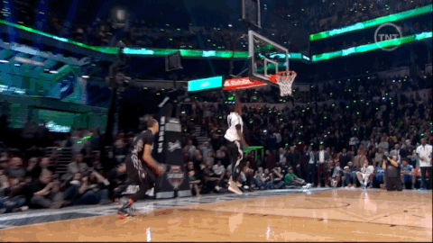
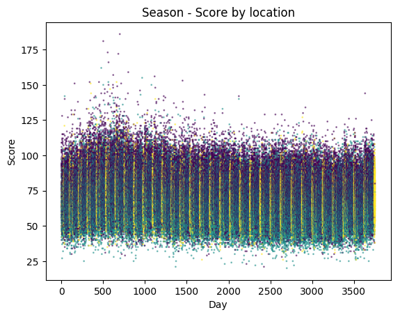
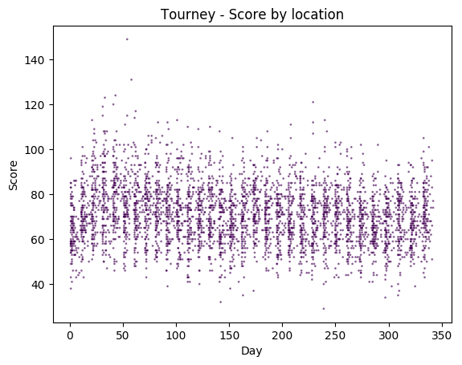
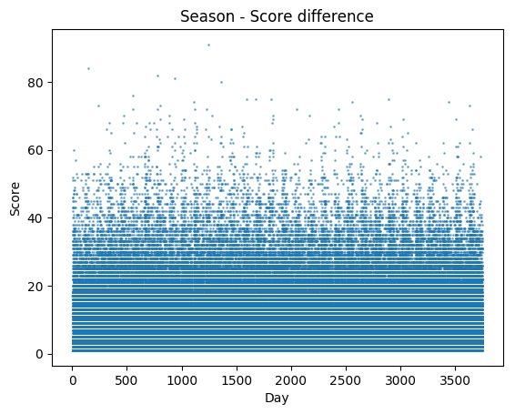
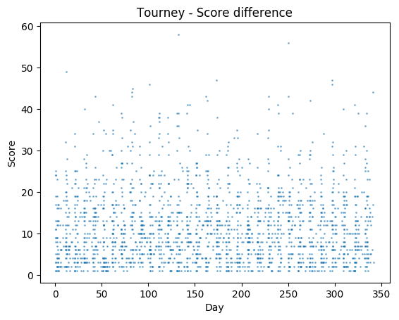
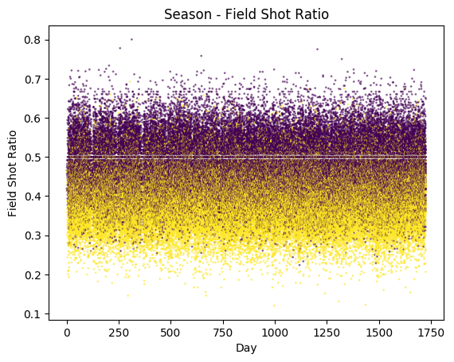
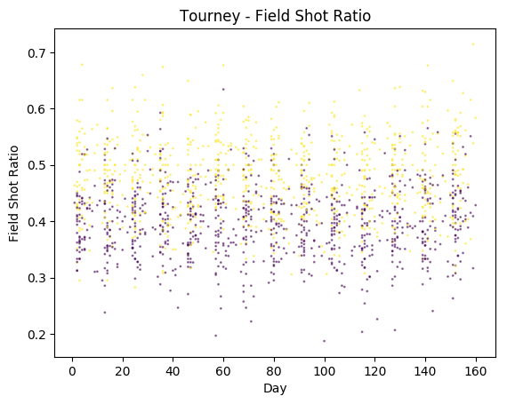
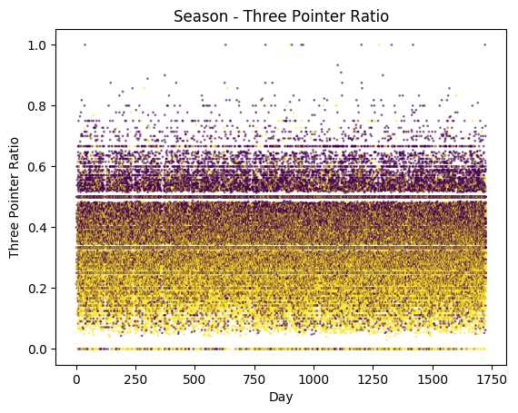
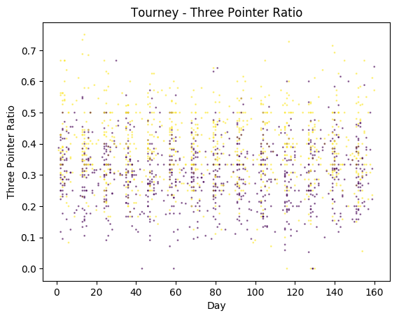
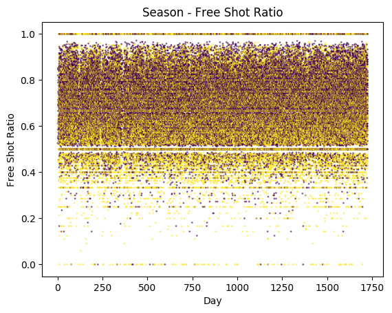

# NCAA - March Machine Learning Mania 2017

]

## Installation

```bash
$ git clone git@github.com:TeamLux/ncaa-mlmm-2017.git
$ cd ncaa-mlmm-2017
$ pip install -r requirements.txt
```

## Plots

Regular Season | Tourney
:-------------------------:|:-------------------------:
 | 
 | 
 | 
 | 
 | 
